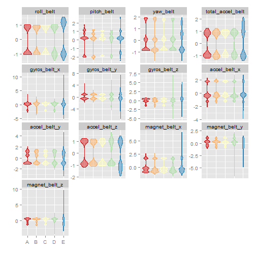
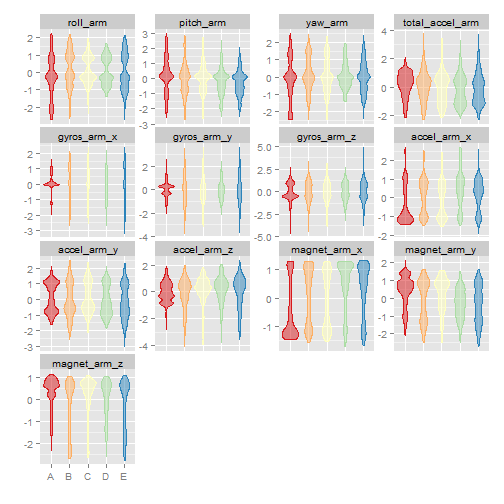
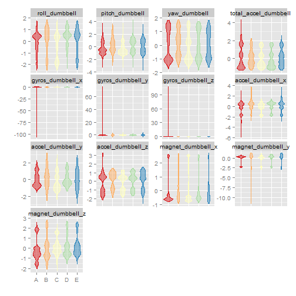
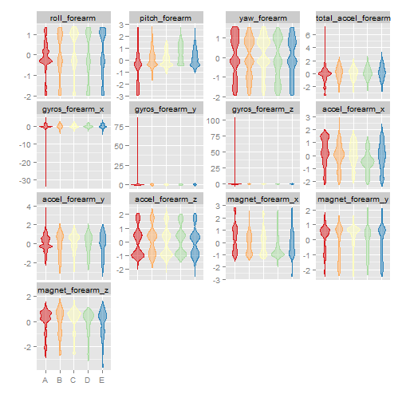

```
## Run time: 2015-08-22 18:43:29
## R version: R version 3.2.0 (2015-04-16) 
## OS: Windows 7 x64
```

#### I. SYNOPSIS:

The purpose of this project is to develop and build a model using machine learning techniques, based on the WLE(Weight Lifting Exercise) Dataset, to predict the manner in which an health participant performed an exercise on 20 different test cases with 'classe' as the ressponse variable.

#### II. DATASET & DESCRIPTION:

The WLE Dataset is available at http://groupware.les.inf.puc-rio.br/har and was collected from sensors(accelerometers) on the belt, forearm, arm, and dumbell of Six health participants) who were asked to perform one set of 10 repetitions of the Unilateral Dumbbell Biceps Curl in five different fashions: exactly according to the specification (Class A), throwing the elbows to the front (Class B), lifting the dumbbell only halfway (Class C), lowering the dumbbell only halfway (Class D) and throwing the hips to the front (Class E). Class A corresponds to the specified execution of the exercise, while the other 4 classes correspond to common mistakes.

Training data :  https://d396qusza40orc.cloudfront.net/predmachlearn/pml-training.csv
Test data :  https://d396qusza40orc.cloudfront.net/predmachlearn/pml-testing.csv

#### III. DATA PREPARATION

Read training and test datasets from the source

```r
# read train data set
require(data.table)
setInternet2(TRUE)
url <- "https://d396qusza40orc.cloudfront.net/predmachlearn/pml-training.csv"
pmlTrainData <- fread(url)
```

```
## 
Read 51.0% of 19622 rows
Read 19622 rows and 160 (of 160) columns from 0.011 GB file in 00:00:04
```

```r
# read test data set
url <- "https://d396qusza40orc.cloudfront.net/predmachlearn/pml-testing.csv"
pmlTestData <- fread(url)
```

#### IV. EDA & PREDICTOR IDENTIFICATION

Perform an EDA(Exploratory Data Analsysis) on the data set.

```r
#summary(pmlTrainData)
#describe(pmlTrainData)
#sapply(pmlTrainData, class)
#str(pmlTrainData)
```
A quick analysis on the test data set shows that we cannot take into all the variables for the prediction and need to identify those predictor variables which are relevant. We are interested in those variables prodcued by sensors with a Non-NA values. 

Also subset the primary dataset to include only the predictor candidates and the outcome/response variable - 'classe'.

```r
# idenitify predictors
isAnyMissing <- sapply(pmlTestData, function (x) any(is.na(x) | x == ""))
isPredictor <- !isAnyMissing & grepl("belt|[^(fore)]arm|dumbbell|forearm", names(isAnyMissing))
predCandidates <- names(isAnyMissing)[isPredictor]

# subset primary dataset for predictor & outcome variables
varToInclude <- c("classe", predCandidates)
pmlTrainData <- pmlTrainData[, varToInclude, with=FALSE]
```

Perform the required Data Cleansing operations and split the dataset into training and probing dataset in the ratio 60:40.
And a final look at the dataset attributes

```r
# classe as factor
pmlTrainData <- pmlTrainData[, classe := factor(pmlTrainData[, classe])]
dim(pmlTrainData)
```

```
## [1] 19622    53
```

```r
names(pmlTrainData)
```

```
##  [1] "classe"               "roll_belt"            "pitch_belt"          
##  [4] "yaw_belt"             "total_accel_belt"     "gyros_belt_x"        
##  [7] "gyros_belt_y"         "gyros_belt_z"         "accel_belt_x"        
## [10] "accel_belt_y"         "accel_belt_z"         "magnet_belt_x"       
## [13] "magnet_belt_y"        "magnet_belt_z"        "roll_arm"            
## [16] "pitch_arm"            "yaw_arm"              "total_accel_arm"     
## [19] "gyros_arm_x"          "gyros_arm_y"          "gyros_arm_z"         
## [22] "accel_arm_x"          "accel_arm_y"          "accel_arm_z"         
## [25] "magnet_arm_x"         "magnet_arm_y"         "magnet_arm_z"        
## [28] "roll_dumbbell"        "pitch_dumbbell"       "yaw_dumbbell"        
## [31] "total_accel_dumbbell" "gyros_dumbbell_x"     "gyros_dumbbell_y"    
## [34] "gyros_dumbbell_z"     "accel_dumbbell_x"     "accel_dumbbell_y"    
## [37] "accel_dumbbell_z"     "magnet_dumbbell_x"    "magnet_dumbbell_y"   
## [40] "magnet_dumbbell_z"    "roll_forearm"         "pitch_forearm"       
## [43] "yaw_forearm"          "total_accel_forearm"  "gyros_forearm_x"     
## [46] "gyros_forearm_y"      "gyros_forearm_z"      "accel_forearm_x"     
## [49] "accel_forearm_y"      "accel_forearm_z"      "magnet_forearm_x"    
## [52] "magnet_forearm_y"     "magnet_forearm_z"
```

```r
pmlTrainData[, .N, classe]
```

```
##    classe    N
## 1:      A 5580
## 2:      B 3797
## 3:      C 3422
## 4:      D 3216
## 5:      E 3607
```


```r
# split dataset [60% - training; 40% - probing]
require(caret)
seed <- as.numeric(as.Date("2015-08-21"))
set.seed(seed)
inTrain <- createDataPartition(pmlTrainData$classe, p=0.6)
trainData <- pmlTrainData[inTrain[[1]]]
probeData <- pmlTrainData[-inTrain[[1]]]
```

The next step would be to estimate pre-processing transformation (centering, scaling etc) from the training data and applied to probe data set with the same variables. Also diagnose predictors for near zero variance. 


```r
# preprocess the prediction variables by centering and scaling.
origData <- trainData[, predCandidates, with=FALSE]
preProcessor <- preProcess(origData)
tranformData <- predict(preProcessor, origData)
DTrainCS <- data.table(data.frame(classe = trainData[, classe], tranformData))

# apply the centering and scaling to the probing dataset.
origData <- probeData[, predCandidates, with=FALSE]
tranformData <- predict(preProcessor, origData)
DProbeCS <- data.table(data.frame(classe = probeData[, classe], tranformData))

# check for near zero variance.
nzv <- nearZeroVar(DTrainCS, saveMetrics=TRUE)
if (any(nzv$nzv)) nzv else message("No variables with near zero variance")
```

```
## No variables with near zero variance
```

Examine groups of prediction variables and its replationship with response variable using plotting.


```r
require(reshape2)
require(ggplot2)

histGroup <- function (data, regex) {
  col <- grep(regex, names(data))
  col <- c(col, which(names(data) == "classe"))
  n <- nrow(data)
  DMelted <- melt(data[, col, with=FALSE][, rownum := seq(1, n)], id.vars=c("rownum", "classe"))
  
  ggplot(DMelted, aes(x=classe, y=value)) +
    geom_violin(aes(color=classe, fill=classe), alpha=1/2) +
    facet_wrap(~ variable, scale="free_y") +
    scale_color_brewer(palette="Spectral") +
    scale_fill_brewer(palette="Spectral") +
    labs(x="", y="") +
    theme(legend.position="none")
}

histGroup(DTrainCS, "belt")
```

 

```r
histGroup(DTrainCS, "[^(fore)]arm")
```

 

```r
histGroup(DTrainCS, "dumbbell")
```

 

```r
histGroup(DTrainCS, "forearm")
```

 

#### V. FITTING A MODEL USING RANDOM FOREST


```r
# set up the parallel clusters.
require(parallel)
require(doParallel)
cl <- makeCluster(detectCores() - 1)
registerDoParallel(cl)

# set the control parameters.
ctrl <- trainControl(classProbs=TRUE,
                     savePredictions=TRUE,
                     allowParallel=TRUE)

#fit model (random forrest) over the tuning parameters.
trainingModel <- train(classe ~ ., data=DTrainCS, method="rf")
#system.time(trainingModel <- train(classe ~ ., data=DTrainCS, method="rf"))

# stop the clusters.
stopCluster(cl)
```

#### VI. OUT-OF SAMPLE ERROR & ERROR ESTIMATE

To evaluate the model we will use the confusionmatrix method and we will focus on accuracy, sensitivity & specificity metrics.  As seen from the result of the confusionmatrix below, the model is good and efficient because it has an accuracy of 0.997 and very good sensitivity & specificity values on the testing dataset. (the lowest value is 0.992 for the sensitivity of the class C)

**The estimated error rate is less than 1%.**


```r
# evaluate the model on the training dataset
trainingModel
```

```
## Random Forest 
## 
## 11776 samples
##    52 predictor
##     5 classes: 'A', 'B', 'C', 'D', 'E' 
## 
## No pre-processing
## Resampling: Bootstrapped (25 reps) 
## Summary of sample sizes: 11776, 11776, 11776, 11776, 11776, 11776, ... 
## Resampling results across tuning parameters:
## 
##   mtry  Accuracy   Kappa      Accuracy SD  Kappa SD   
##    2    0.9860429  0.9823473  0.001776708  0.002240671
##   27    0.9860108  0.9823071  0.001742289  0.002198113
##   52    0.9798819  0.9745544  0.003910534  0.004951608
## 
## Accuracy was used to select the optimal model using  the largest value.
## The final value used for the model was mtry = 2.
```

```r
hat <- predict(trainingModel, DTrainCS)
confusionMatrix(hat, trainData[, classe])
```

```
## Confusion Matrix and Statistics
## 
##           Reference
## Prediction    A    B    C    D    E
##          A 3348    0    0    0    0
##          B    0 2279    0    0    0
##          C    0    0 2054    0    0
##          D    0    0    0 1930    0
##          E    0    0    0    0 2165
## 
## Overall Statistics
##                                      
##                Accuracy : 1          
##                  95% CI : (0.9997, 1)
##     No Information Rate : 0.2843     
##     P-Value [Acc > NIR] : < 2.2e-16  
##                                      
##                   Kappa : 1          
##  Mcnemar's Test P-Value : NA         
## 
## Statistics by Class:
## 
##                      Class: A Class: B Class: C Class: D Class: E
## Sensitivity            1.0000   1.0000   1.0000   1.0000   1.0000
## Specificity            1.0000   1.0000   1.0000   1.0000   1.0000
## Pos Pred Value         1.0000   1.0000   1.0000   1.0000   1.0000
## Neg Pred Value         1.0000   1.0000   1.0000   1.0000   1.0000
## Prevalence             0.2843   0.1935   0.1744   0.1639   0.1838
## Detection Rate         0.2843   0.1935   0.1744   0.1639   0.1838
## Detection Prevalence   0.2843   0.1935   0.1744   0.1639   0.1838
## Balanced Accuracy      1.0000   1.0000   1.0000   1.0000   1.0000
```

```r
# final model
varImp(trainingModel)
```

```
## rf variable importance
## 
##   only 20 most important variables shown (out of 52)
## 
##                      Overall
## roll_belt             100.00
## yaw_belt               78.32
## magnet_dumbbell_z      65.79
## magnet_dumbbell_y      58.90
## pitch_belt             58.65
## pitch_forearm          58.00
## roll_forearm           48.64
## magnet_dumbbell_x      47.05
## magnet_belt_z          42.79
## accel_belt_z           41.64
## accel_dumbbell_y       41.63
## magnet_belt_y          41.44
## roll_dumbbell          40.76
## accel_dumbbell_z       37.55
## roll_arm               34.26
## gyros_belt_z           31.72
## accel_forearm_x        31.20
## yaw_dumbbell           28.53
## total_accel_dumbbell   27.42
## accel_dumbbell_x       26.64
```

```r
trainingModel$finalModel
```

```
## 
## Call:
##  randomForest(x = x, y = y, mtry = param$mtry) 
##                Type of random forest: classification
##                      Number of trees: 500
## No. of variables tried at each split: 2
## 
##         OOB estimate of  error rate: 0.94%
## Confusion matrix:
##      A    B    C    D    E  class.error
## A 3346    0    1    0    1 0.0005973716
## B   23 2247    9    0    0 0.0140412462
## C    0   22 2029    3    0 0.0121713729
## D    0    0   39 1887    4 0.0222797927
## E    0    0    2    7 2156 0.0041570439
```

```r
# save training model
save(trainingModel, file="trainingModel.RData")

# Get predictions and evaluate.
DTestCS <- predict(preProcessor, pmlTestData[, predCandidates, with=FALSE])
hat <- predict(trainingModel, DTestCS)
pmlTestData <- cbind(hat , pmlTestData)
subset(pmlTestData, select=names(pmlTestData)[grep("belt|[^(fore)]arm|dumbbell|forearm", names(pmlTestData), invert=TRUE)])
```

```
##     hat V1 user_name raw_timestamp_part_1 raw_timestamp_part_2
##  1:   B  1     pedro           1323095002               868349
##  2:   A  2    jeremy           1322673067               778725
##  3:   B  3    jeremy           1322673075               342967
##  4:   A  4    adelmo           1322832789               560311
##  5:   A  5    eurico           1322489635               814776
##  6:   E  6    jeremy           1322673149               510661
##  7:   D  7    jeremy           1322673128               766645
##  8:   B  8    jeremy           1322673076                54671
##  9:   A  9  carlitos           1323084240               916313
## 10:   A 10   charles           1322837822               384285
## 11:   B 11  carlitos           1323084277                36553
## 12:   C 12    jeremy           1322673101               442731
## 13:   B 13    eurico           1322489661               298656
## 14:   A 14    jeremy           1322673043               178652
## 15:   E 15    jeremy           1322673156               550750
## 16:   E 16    eurico           1322489713               706637
## 17:   A 17     pedro           1323094971               920315
## 18:   B 18  carlitos           1323084285               176314
## 19:   B 19     pedro           1323094999               828379
## 20:   B 20    eurico           1322489658               106658
##       cvtd_timestamp new_window num_window problem_id
##  1: 05/12/2011 14:23         no         74          1
##  2: 30/11/2011 17:11         no        431          2
##  3: 30/11/2011 17:11         no        439          3
##  4: 02/12/2011 13:33         no        194          4
##  5: 28/11/2011 14:13         no        235          5
##  6: 30/11/2011 17:12         no        504          6
##  7: 30/11/2011 17:12         no        485          7
##  8: 30/11/2011 17:11         no        440          8
##  9: 05/12/2011 11:24         no        323          9
## 10: 02/12/2011 14:57         no        664         10
## 11: 05/12/2011 11:24         no        859         11
## 12: 30/11/2011 17:11         no        461         12
## 13: 28/11/2011 14:14         no        257         13
## 14: 30/11/2011 17:10         no        408         14
## 15: 30/11/2011 17:12         no        779         15
## 16: 28/11/2011 14:15         no        302         16
## 17: 05/12/2011 14:22         no         48         17
## 18: 05/12/2011 11:24         no        361         18
## 19: 05/12/2011 14:23         no         72         19
## 20: 28/11/2011 14:14         no        255         20
```

#### VII. PREDICTION ON TEST SET
And the final prediction on the 20 test cases are: 

1 2 3 4 5 6 7 8 9 10 11 12 13 14 15 16 17 18 19 20
B A B A A E D B A  A  B  C  B  A  E  E  A  B  B  B
